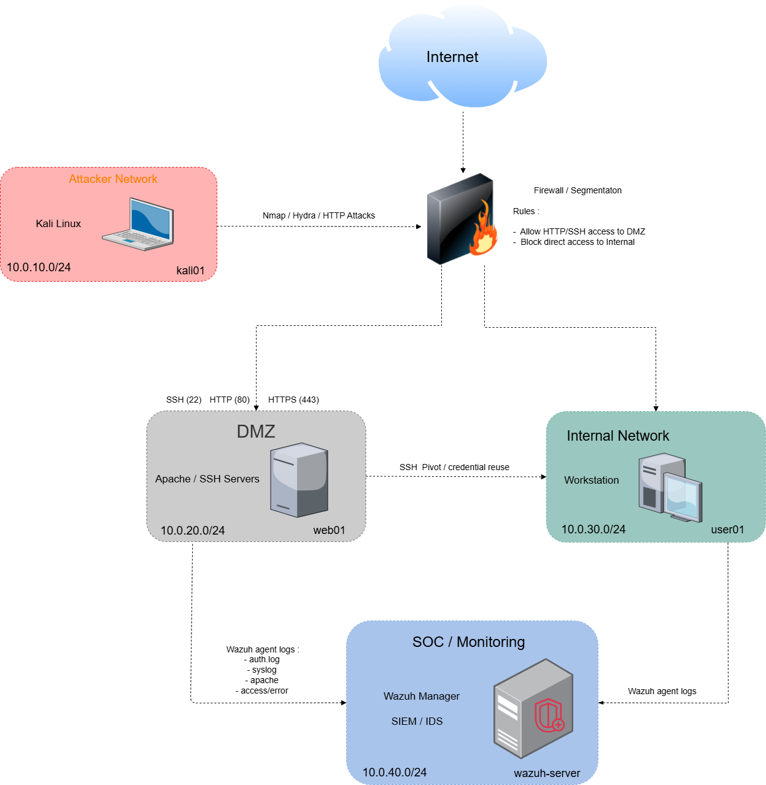

# SOC Lab – Cyber Defense Home Lab

> A fully segmented SOC environment built for attack simulation, detection engineering, and log analysis.  
> Designed as a portfolio project targeting SOC Analyst and Blue Team roles.

---

## Overview

This lab simulates a small enterprise infrastructure monitored by a Security Operations Center.  
The goal is to practice real SOC workflows : deploy infrastructure, simulate attacks, detect them, investigate, and document.

The project is built to **grow over time** — each new attack scenario adds a detection, a MITRE mapping, and a documented investigation.

---

## Architecture



The lab is divided into four network zones :

| Zone | Machine | IP | Role |
|------|---------|-----|------|
| Attacker | Kali Linux (`kali01`) | 192.168.63.101 | Attack simulation |
| DMZ | Ubuntu 22.04 (`Ubuntu1`) | 192.168.63.109 | Exposed target (SSH, Apache) |
| SOC | Wazuh Manager | 192.168.63.101 | SIEM – log collection and alerting |

Full network design : [architecture/network-design.md](architecture/network-design.md)

---

## Stack

| Tool | Role |
|------|------|
| **Wazuh v4.14.4** | SIEM – log collection, alerting, MITRE ATT&CK mapping |
| **Kali Linux** | Attacker machine – Hydra, Nmap, etc. |
| **Ubuntu 22.04 LTS** | Target machine with Wazuh agent deployed |
| **VirtualBox** | Hypervisor |
| **Bash** | Automation scripts |

---

## Attack Scenarios

Each scenario includes : attack execution, SIEM detection, MITRE ATT&CK mapping, and analyst notes.

| Scenario | Status | MITRE Techniques | Detection |
|----------|--------|-----------------|-----------|
| [SSH Brute Force](attack-scenarios/ssh-bruteforce/README.md) |  Done | T1110, T1110.001, T1078, T1021 | Wazuh rules 5760, 2502, 5715 |
| [Web Attack](attack-scenarios/web-attack/README.md) |  Planned | T1190 | - |
| [Lateral Movement](attack-scenarios/lateral-movement/README.md) |  Planned | T1021 | - |
| [Persistence](attack-scenarios/persistence/README.md) |  Planned | T1053, T1136 | - |

---

## Detection Engineering

Custom Wazuh rules written for this lab :

| Rule | Description | Scenario |
|------|-------------|---------|
|  Planned | Alert on brute force success (>50 failures + login from same IP) | SSH Brute Force |

Full detection rules : [detections/](detections/)  
MITRE mapping : [detections/mitre-mapping/](detections/mitre-mapping/)

---

## SOC Workflow

Every scenario in this lab follows the same workflow :

```
Deploy infrastructure
        ↓
Simulate attack
        ↓
Collect and analyze logs
        ↓
Validate detection in Wazuh
        ↓
Map to MITRE ATT&CK
        ↓
Document findings
        ↓
Improve detection rules
```

---

## Repository Structure

```
soc-lab/
├── architecture/          # Network diagrams and IP plan
├── attack-scenarios/      # Attack simulations with detection reports
│   ├── ssh-bruteforce/
│   ├── web-attack/
│   ├── lateral-movement/
│   └── persistence/
├── detections/            # Custom Wazuh rules and MITRE mapping
│   └── mitre-mapping/
├── wazuh/                 # Wazuh configuration and custom rules
└── README.md
```

---

## Skills Demonstrated

- SIEM deployment and configuration (Wazuh)
- Agent deployment and log collection
- Attack simulation (Hydra, Nmap)
- Log analysis and alert investigation
- MITRE ATT&CK framework mapping
- Detection engineering
- Infrastructure segmentation
- Documentation and reporting

---

## Project Status

 Active — updated regularly as new scenarios are added.

---
