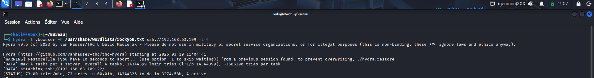
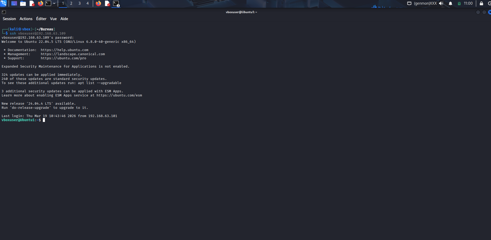
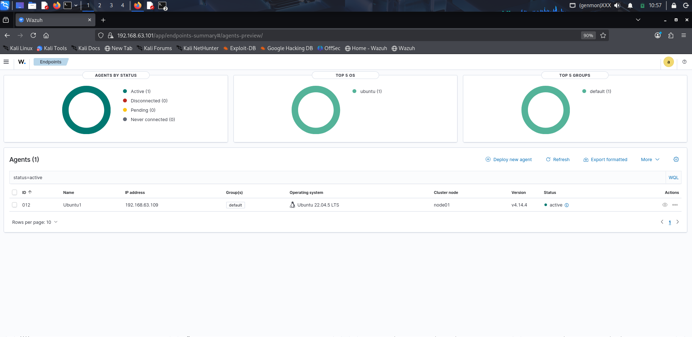
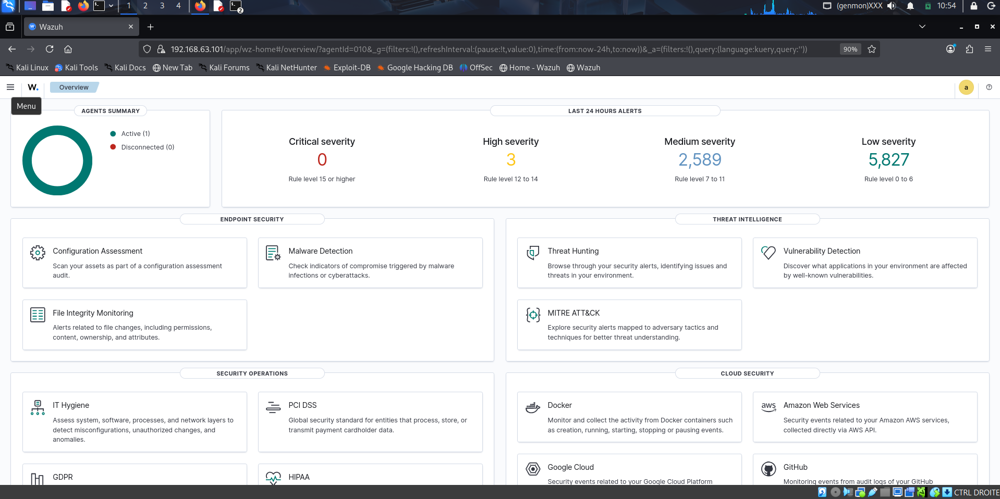
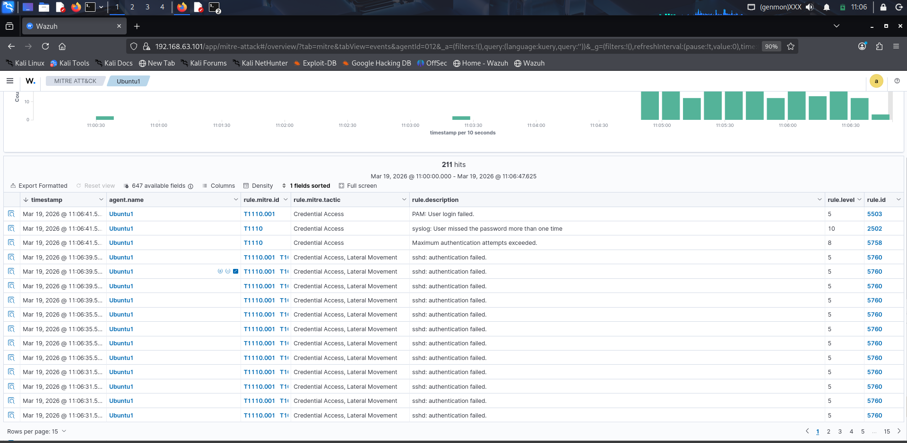
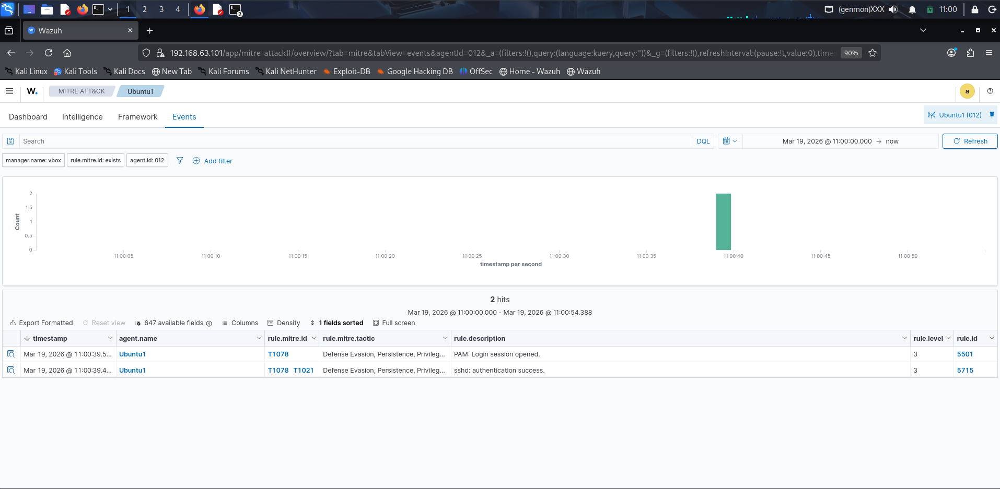

# SSH Brute Force Attack – Detection Scenario

## Overview

This scenario simulates a SSH brute force attack launched from a Kali Linux attacker machine against an Ubuntu target monitored by Wazuh.  
The goal is to validate that the SIEM correctly detects authentication failures, brute force patterns, and successful logins — and maps them to the MITRE ATT&CK framework.

---

## Lab Environment

| Role | Machine | IP Address |
|------|---------|------------|
| Attacker | Kali Linux (`kali01`) | 192.168.63.101 |
| Target | Ubuntu 22.04 LTS (`Ubuntu1`) | 192.168.63.109 |
| SIEM | Wazuh v4.14.4 | 192.168.63.101 |

The Wazuh agent (ID 012) is deployed and active on the target machine, forwarding logs in real time to the Wazuh manager.

---

## Attack Execution

### Tool used
- **Hydra v9.6** – network login brute force tool

### Command

```bash
hydra -l vboxuser -P /usr/share/wordlists/rockyou.txt ssh://192.168.63.109 -t 4
```

### Parameters explained

| Parameter | Value | Description |
|-----------|-------|-------------|
| `-l` | `vboxuser` | Single username targeted |
| `-P` | `rockyou.txt` | Password wordlist (14,344,399 entries) |
| `ssh://` | `192.168.63.109` | Target protocol and IP |
| `-t 4` | 4 | Number of parallel threads |

### Execution details
- Start time : `2026-03-19 @ 11:04:41`
- Speed : ~73 tries/minute
- Total attempts loaded : 14,344,399

> The attack successfully authenticated at `11:00:39` after iterating through the wordlist, confirming the target account had a weak password.

**Screenshot – Hydra attack launched from Kali :**



**Screenshot – Successful SSH login on Ubuntu1 :**



---

## Detection – Wazuh SIEM

### Agent status

The Wazuh agent on Ubuntu1 was active throughout the attack, ensuring continuous log forwarding.



---

### Dashboard Overview

The Wazuh overview dashboard shows the alert volume generated during the attack window :

- **High severity** : 3 alerts (rule level 12–14)
- **Medium severity** : 2,589 alerts (rule level 7–11)
- **Low severity** : 5,827 alerts (rule level 0–6)



---

### Alert Timeline

The MITRE ATT&CK events view shows **211 hits** detected between `11:00:00` and `11:06:47` on agent Ubuntu1.

The alert volume clearly increases over time, matching the sustained brute force activity from Hydra.



---

### Alerts Breakdown

| Rule ID | MITRE Tactic | Description | Level |
|---------|-------------|-------------|-------|
| 5760 | Credential Access, Lateral Movement | sshd: authentication failed | 5 |
| 5758 | Credential Access | Maximum authentication attempts exceeded | 8 |
| 2502 | Credential Access | syslog: User missed the password more than once | 10 |
| 5503 | Credential Access | PAM: User login failed | 5 |

> Rule **2502** (level 10) and **5758** (level 8) are key indicators of a brute force pattern — they trigger only after repeated failures, not on a single wrong password.

---

### Successful Login Detection

At `11:00:39`, the brute force succeeded. Wazuh immediately generated two events mapping to MITRE techniques :

| Rule ID | MITRE ID | Tactic | Description |
|---------|---------|--------|-------------|
| 5715 | T1078, T1021 | Defense Evasion, Persistence, Privilege Escalation | sshd: authentication success |
| 5501 | T1078 | Defense Evasion, Persistence, Privilege Escalation | PAM: Login session opened |

> This is critical : the successful login after hundreds of failures is a clear brute force indicator. A SOC analyst would correlate rule 5715 appearing right after a burst of rule 5760 to confirm the attack was successful.



---

## MITRE ATT&CK Mapping

| Technique ID | Name | Phase |
|-------------|------|-------|
| T1110 | Brute Force | Credential Access |
| T1110.001 | Password Guessing | Credential Access |
| T1078 | Valid Accounts | Defense Evasion / Persistence |
| T1021 | Remote Services | Lateral Movement |

---

## Detection Summary

| What happened | Was it detected ? | Rule(s) triggered |
|--------------|------------------|-------------------|
| Individual failed SSH logins |  Yes | 5760 |
| Repeated failures (brute force pattern) |  Yes | 2502, 5758 |
| Successful login after brute force |  Yes | 5715, 5501 |

**All phases of the attack were successfully detected by Wazuh.**

---

## Analyst Notes

- The attack generated **211 MITRE-mapped events** in under 7 minutes
- The combination of high-volume rule 5760 + rule 2502 (level 10) is a reliable brute force signature
- The transition from failed logins to rule 5715 (success) is the most important correlation point for a SOC analyst
- No active response was configured at this stage — IP blocking via Wazuh active response is planned as a future improvement

---


